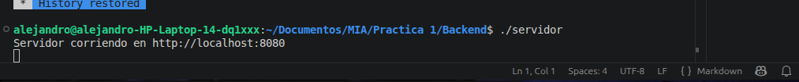
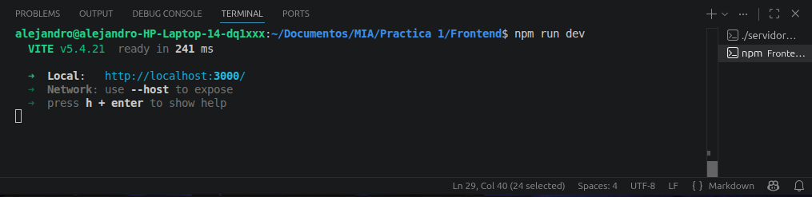
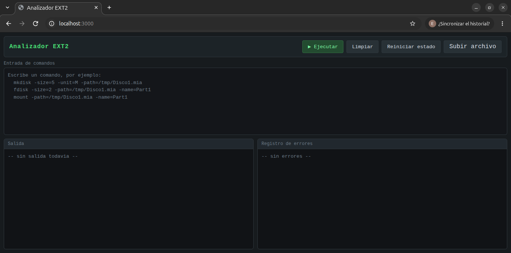
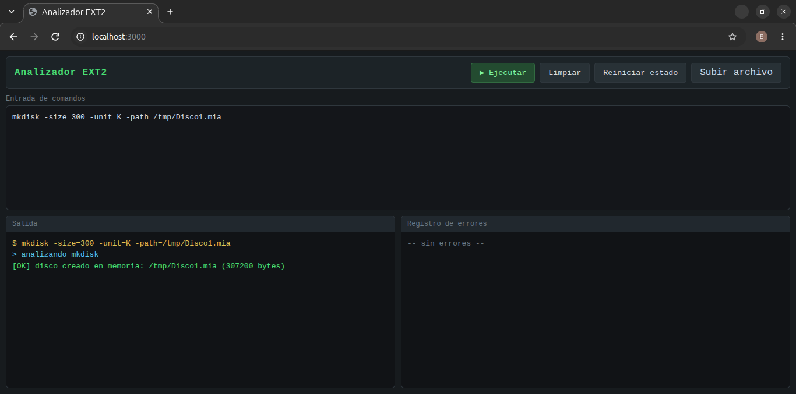
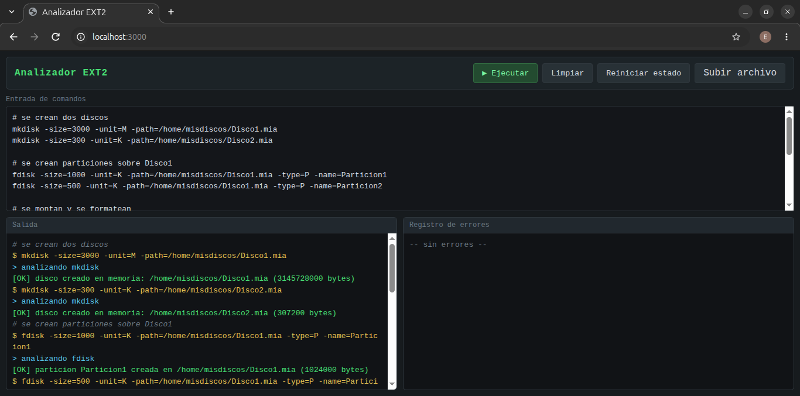

# Manual de usuario


| | |
|---|---|
| **Proyecto** | Analizador de comandos EXT2 |
| **Curso** | Manejo e Implementacion de Archivos (MIA) |
| **Practica** | 1 |
| **Carnet** | 201807092 |
| **Nombre del estudiante** | Eduardo Enmanuel Alejandro Zamora Gomez |
| **Fecha** | Agosto 2026 |

---

## 1. Introduccion

Este manual explica como usar el analizador de comandos EXT2. El sistema permite escribir comandos tipo terminal y validar su sintaxis, como parte de la practica 1 del curso. Todo se ejecuta de forma simulada: el analizador revisa que los comandos esten bien escritos y guarda el resultado en memoria para poder ver el flujo completo de una sesion.

El manual esta pensado para cualquier persona que quiera usar la aplicacion, sin importar si conoce C++ o React.

## 2. Requisitos

| Requerimiento | Version |
|---------------|---------|
| Sistema operativo | Windows o Linux |
| Node.js | 22 o superior |
| npm | 10 o superior |
| Compilador C++ | g++ con soporte C++17 |
| Navegador | Chrome, Firefox, Edge |

## 3. Instalacion

### 3.1 Compilar el backend

Abrir una terminal dentro del proyecto, ir a la carpeta `Backend` y compilar:

```bash
make analizador
make servidor
```

> Nota: en Windows se puede usar un entorno como WSL o MinGW para ejecutar el `make`.

## 4. Como ejecutar el sistema

### 4.1 Levantar el servidor de la API

1. Abrir una terminal en la carpeta `Backend`.
2. Ejecutar `./servidor`.
3. Debe aparecer el mensaje `Servidor corriendo en http://localhost:8080`.



### 4.2 Levantar el frontend

1. Abrir otra terminal en la carpeta `Frontend`.
2. Ejecutar `npm install` (solo la primera vez).
3. Ejecutar `npm run dev`.
4. La aplicacion se abre en `http://localhost:3000`.



## 5. La interfaz

La aplicacion se divide en tres zonas:

1. **Barra superior**: el titulo del analizador y los botones de accion.
2. **Entrada de comandos**: el cuadro de texto donde se escriben los comandos.
3. **Panel de salida**: dos paneles, la Salida y el Registro de errores.



### 5.1 Botones de la barra superior

| Boton | Funcion |
|-------|---------|
| ▶ Ejecutar | Analiza todos los comandos que estan en la entrada |
| Limpiar | Borra la entrada y los paneles de salida |
| Reiniciar estado | Vacia el estado del backend para empezar una sesion nueva |
| Subir archivo | Carga un archivo `.mia` o `.txt` con comandos dentro de la entrada |

### 5.2 Entrada de comandos

- Se puede escribir un comando por linea o varios comandos, uno debajo del otro.
- Con **Enter** se ejecuta; con **Shift + Enter** se hace un salto de linea.
- Las lineas que empiezan con `#` son comentarios: se muestran en la salida pero no se envian al backend.

### 5.3 Salida y Registro de errores

- La **Salida** muestra los comandos enviados (con `$`) y las respuestas del analizador.
- Las respuestas exitosas aparecen con fondo verde (`[OK]`).
- Los errores aparecen en rojo (`[ERROR]`) tanto en la Salida como en el Registro de errores.



## 6. Como escribir los comandos

Todos los comandos siguen la forma:

```
comando -parametro1=valor1 -parametro2=valor2
```

- El orden de los parametros no importa.
- Los nombres de los parametros no distinguen mayusculas.
- Si una ruta tiene espacios, se escribe entre comillas: `-path="/home/yo/Disco Uno.mia"`.

## 7. Comandos soportados

### 7.1 `mkdisk` — crear un disco

```bash
mkdisk -size=3000 -unit=M -path=/home/misdiscos/Disco1.mia
```

| Parametro | Descripcion |
|-----------|-------------|
| `-size` | Tamaño del disco (obligatorio) |
| `-unit` | Unidad: `k` o `m` (opcional, por defecto `m`) |
| `-fit` | Ajuste: `bf`, `ff`, `wf` (opcional, por defecto `ff`) |
| `-path` | Ruta del disco (obligatorio) |

### 7.2 `rmdisk` — eliminar un disco

```bash
rmdisk -path=/home/misdiscos/Disco1.mia
```

### 7.3 `fdisk` — crear una particion

```bash
fdisk -size=1000 -path=/home/misdiscos/Disco1.mia -name=Particion1
```

| Parametro | Descripcion |
|-----------|-------------|
| `-size` | Tamaño de la particion (obligatorio) |
| `-path` | Disco donde se crea (obligatorio) |
| `-name` | Nombre de la particion, unico en el disco (obligatorio) |
| `-type` | Tipo: `p`, `e`, `l` (opcional, por defecto `p`) |
| `-unit` | Unidad: `b`, `k`, `m` (opcional, por defecto `k`) |
| `-fit` | Ajuste: `bf`, `ff`, `wf` (opcional, por defecto `ff`) |

### 7.4 `mount` — montar una particion

```bash
mount -path=/home/misdiscos/Disco1.mia -name=Particion1
```

El id se genera automaticamente con los ultimos 2 digitos del carnet, el numero de particion y la letra del disco (ejemplo: `921A`).

### 7.5 `mkfs` — formatear una particion

```bash
mkfs -id=921A
```

| Parametro | Descripcion |
|-----------|-------------|
| `-id` | Id de la particion montada (obligatorio) |
| `-type` | Solo acepta `full` (opcional, por defecto `full`) |

### 7.6 `mkusr` — crear un usuario

```bash
mkusr -user=ana -pass=12345 -grp=users
```

| Parametro | Descripcion |
|-----------|-------------|
| `-user` | Nombre del usuario, maximo 10 caracteres (obligatorio) |
| `-pass` | Contraseña, maximo 10 caracteres (obligatorio) |
| `-grp` | Grupo, maximo 10 caracteres (obligatorio) |

### 7.7 `rmusr` — eliminar un usuario

```bash
rmusr -user=ana
```

### 7.8 `mkfile` — crear un archivo

```bash
mkfile -path=/home/misdiscos/archivo.txt -size=1024
```

| Parametro | Descripcion |
|-----------|-------------|
| `-path` | Ruta del archivo (obligatorio) |
| `-r` | Flag que permite crear archivos en rutas intermedias (opcional) |
| `-size` | Tamaño del archivo, no negativo (opcional) |
| `-cont` | Ruta de un archivo del cual se copia el contenido (opcional) |

## 8. Ejemplo completo de una sesion

Pegar los siguientes comandos en la entrada y presionar **Ejecutar**:

```
# se crean dos discos
mkdisk -size=3000 -unit=M -path=/home/misdiscos/Disco1.mia
mkdisk -size=300 -unit=K -path=/home/misdiscos/Disco2.mia

# se crean particiones sobre Disco1
fdisk -size=1000 -unit=K -path=/home/misdiscos/Disco1.mia -type=P -name=Particion1
fdisk -size=500 -unit=K -path=/home/misdiscos/Disco1.mia -type=P -name=Particion2

# se montan y se formatean
mount -path=/home/misdiscos/Disco1.mia -name=Particion1
mount -path=/home/misdiscos/Disco1.mia -name=Particion2
mkfs -id=921A

# se crean usuarios
mkusr -user=ana -pass=12345 -grp=users
mkusr -user=bob -pass=abc -grp=users

# se crean archivos
mkfile -path=/home/misdiscos/nota.txt -size=50
```



## 9. Errores comunes y soluciones

| Error | Causa | Solucion |
|-------|-------|----------|
| `falta el parametro obligatorio` | Falto escribir un parametro que si o si se necesita | Revisar que este `-size`, `-path`, etc. |
| `el parametro -x no es valido` | El parametro no pertenece a ese comando | Verificar los parametros de la seccion 7 |
| `el parametro -x se repitio` | El mismo parametro se escribio dos veces | Dejar solo una ocurrencia |
| `comillas sin cerrar` | Una ruta con comillas no se cerro | Revisar que cada `"` tenga su cierre |
| `ya existe un disco en esa ruta` | Se intento crear un disco que ya existe | Cambiar la ruta o usar `rmdisk` |
| `el comando X no existe` | El comando esta mal escrito | Revisar la ortografia del comando |

## 10. Sugerencias

- Usar el boton **Subir archivo** para cargar directamente el archivo.
- Presionar **Reiniciar estado** antes de volver a correr un archivo, para que no se acumulen los discos de la corrida anterior.
- Probar primero en el analizador de consola (`./analizador`) si no quieren abrir el navegador.

---

_Fin del manual de usuario_